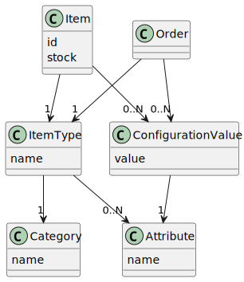

# Backend Java developer exercise

A set of DTO classes modeling the provided eshop example. This does not model DB tables or JPA entities.

The lookup method iterates over all `Item` instances stored in memory and looks for one that matches the 
restrictions defined by the Order (item type and required configuration values). 

Alternatives:
- Instead of keeping number of pieces in stock with each `Item` record, we could store each individual stock item as one `Item` instance.
- `Item`s could be stored in a `HashMap` for faster lookup, e.g.: `Map<ItemType, List<Item>>`.
- Normally the data might be stored in a SQL database for example
  - the database tables might be designed differently than the DTO classes
  - the application shouldn't normally keep all the items in memory
  - item lookup should be done in a database not in java code
